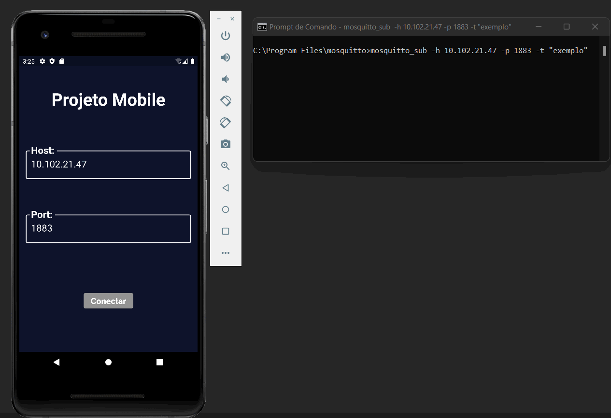

# Aplicação móvel para consumo de serviços em uma infraestrutura de IoT

## Iniciação Científica realizada pelo programa PIBIT-CNPq

O projeto fomentado pelo CNPq buscou desenvolver um aplicativo que contesse as funcionalidades básicas para ser integrado ao uso de qualquer infraestrutura de IoT que usasse o protocolo MQTT. A partir dessa proposta, foram realizados estudos para definir a linguagem de programação ou *framework* que seria usado para o desenvolvimento, após a pesquisa foi definido o uso do *framework* Flutter.

O aplicativo possui uma tela de login, na qual o usuário insere uma *Host* e uma *Port* para ser realizada a conexão, após o estabelecimento dessa, o usuário é redirecionado para uma página onde poderá incluir as funcionalidades: **Botão ON/OFF**, **Envio de Mensagem** e **Recebimento de Mensagem**. Para cada nova funcionalidade cadastrada é necessário que o usuário insira alguns dados, na tela para o cadastro do Botão ON/OFF, é necessário o preenchimento de um campo de título para a aplicação, o nome do tópico e os valores para serem enviados quando o usuário ligar (ON) ou desligar (OFF) o dispositivo cadastrado. Já as telas para o cadastro das funcionalidades Envio e Recebimento de mensagem, são iguais, essas possuem dois campos, sendo o primeiro deles para o cadastro do título e o segundo para o cadastro do tópico. O *gif* apresentado abaixo é um exemplo do funcionamento do aplicativo.

O recebimento de sinal enviado pelo botão tem apresentado atraso em alguns casos, o sinal é enviado corretamente como mostra o teste pelo terminal, entretanto, a atualização na funcionalidade Recebimento de Mensagem está contendo alguns atrasos e em alguns casos o valor encontrado na tela não corresponde ao último valor enviado. Entretando, no uso conjunto das funcionalidades principais, Envio e Recebimento de Mensagem não foram apresentados erros durante o período de testes.

&nbsp;
&nbsp;
&nbsp;

